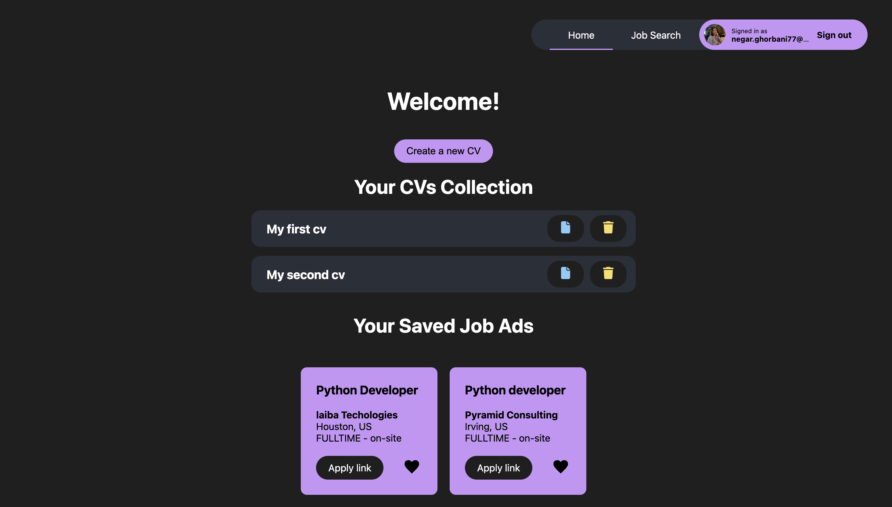
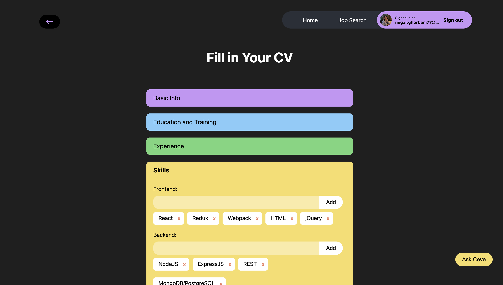
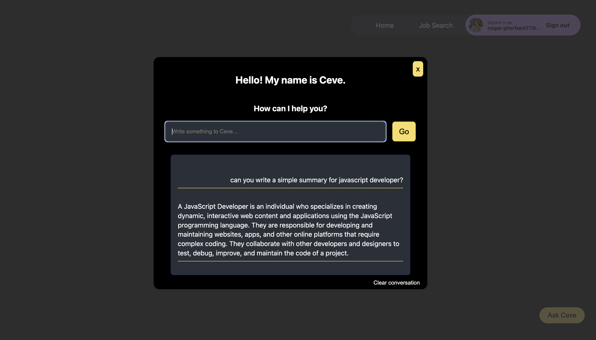
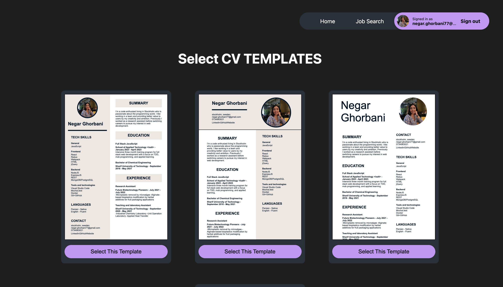
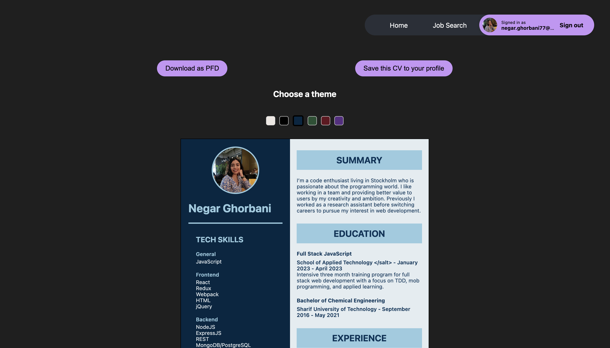
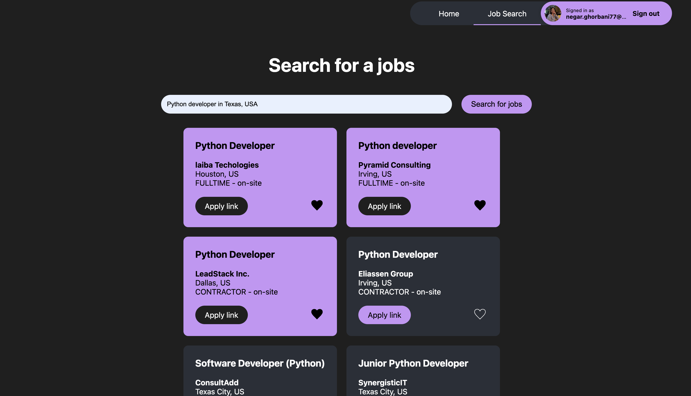

# CV-Creator
> This app allows you to build your own cv with multiple templates and styles, and then download it as a PDF or save it to your account. We included a job search tool that displays job ads from LinkedIn, Indeed, Glassdoor, ZipRecruiter, BeBee, and many other sites, along with an apply link for easy application. You can also save job ads in your profile.

## Table of Contents
* [General Info](#general-information)
* [Technologies Used](#technologies-used)
* [Screenshots](#screenshots)
* [Setup](#setup)
* [Room for Improvement](#room-for-improvement)
<!-- * [License](#license) -->

## General Information
- This project made use of next js authentication, and allows users to log in using their Google or Github accounts.

- All cv information would be saved in the user account for the purpose of creating different cvs using different templates.

- The user can ask CEVE, the AI assistant, to assist them in writing their resumes and answering their queries.

- CVs can be stored with custom names and various templates and displayed on the homepage.

- Users can like their favorite job ads to appear on the home page.

- Users can easily access and delete previous CVs.

- The design implemented by styled component 

<!-- You don't have to answer all the questions - just the ones relevant to your project. -->

## Technologies Used
- NextJs
- React
- MongoDB
- TypeScript
- HTML
- CSS
- Cypress
- Docker

## Screenshots

<!-- If you have screenshots you'd like to share, include them here. -->

## Setup
 Project requirements/dependencies are all listed in package.json file.

## Room for Improvement
To do:
- Integrate to the LinkedIn API to autofill the form

<!-- Optional -->
<!-- ## License -->
<!-- This project is open source and available under the [... License](). -->

<!-- You don't have to include all sections - just the one's relevant to your project -->